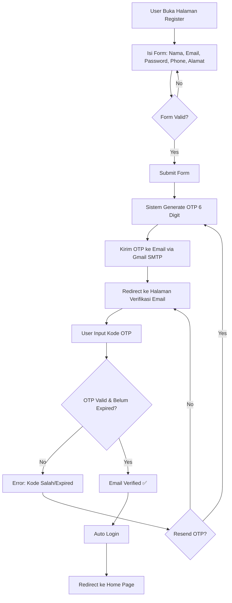
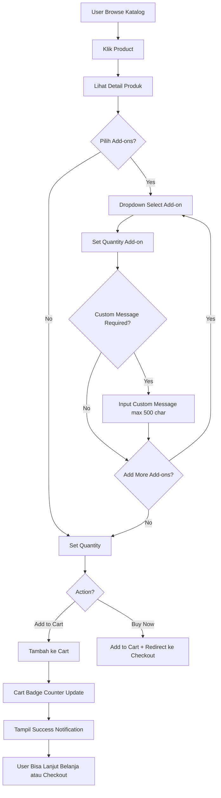
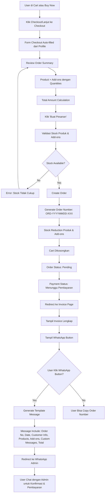
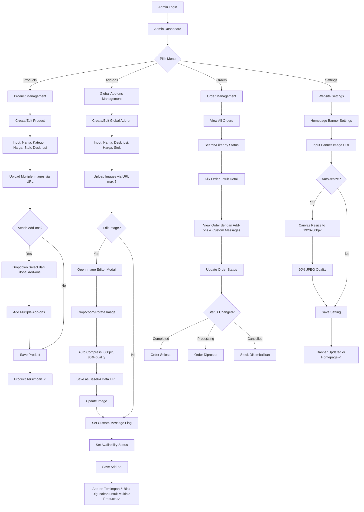
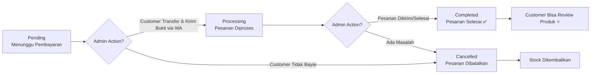
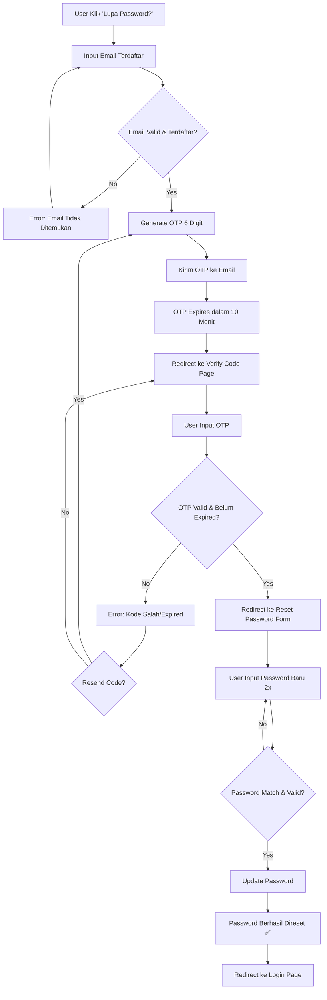
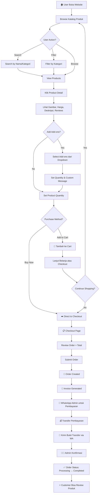

# Florist Shop Website

Website florist modern yang dirancang untuk memudahkan pelanggan dalam melihat katalog bunga, melakukan pemesanan dengan verifikasi email, serta mempermudah admin dalam mengelola pesanan dan produk secara efisien.

 **Developer Guide**: Untuk panduan teknis, setup, dan pengembangan, lihat [DEV-README.md](DEV-README.md)

---

## User Features

1. **Authentication**
   - Register dengan verifikasi email (OTP 6 digit)
   - Login dengan email & password
   - Forgot Password dengan verifikasi kode
   - Logout

2. **Profil Management**
   - Edit profil (Nama, Email, Phone, Alamat, Kota, Kode Pos)
   - Ganti password dengan verifikasi OTP
   - Delete account

3. **Katalog & Shopping**
   - Melihat katalog produk bunga
   - Filter by kategori
   - Detail produk dengan multiple images
   - **Product Add-ons** dengan dropdown selection (v1.3.0 🆕)
   - Custom message untuk add-ons tertentu
   - Tambah produk + add-ons ke keranjang
   - Direct Order (beli langsung tanpa keranjang)

4. **Keranjang Belanja**
   - Melihat semua item di keranjang
   - Update jumlah produk
   - Hapus item dari keranjang
   - Checkout semua item sekaligus
   - Cart icon dengan badge count

5. **Pemesanan**
   - Order langsung dari detail produk (Direct Order)
   - Order dari keranjang (Cart Checkout)
   - Form otomatis terisi data user (nama, email, phone, alamat)
   - Input jumlah & catatan khusus
   - Generate invoice otomatis

6. **Riwayat Pesanan**
   - Melihat semua pesanan
   - Detail pesanan dengan add-ons
   - **Status "Menunggu Pembayaran"** untuk pending orders (v1.3.0 🆕)
   - **WhatsApp Button** dengan detailed message template (v1.3.0 🆕):
     - Order number dan tanggal
     - Customer info lengkap
     - List produk + add-ons dengan custom messages
     - Total pembayaran
   - Invoice lengkap untuk customer reference

---

## User Flow

### **1. Register & Verifikasi Email**
```
User membuka web florist
  ↓
User klik "Daftar"
  ↓
User mengisi form register (Nama, Email, Password, Phone, Alamat, Kota, Kode Pos)
  ↓
Sistem generate kode verifikasi 6 digit
  ↓
Kode dikirim ke email user (Gmail SMTP)
  ↓
User cek email → copy kode
  ↓
User input kode di halaman verifikasi
  ↓
Email terverifikasi ✅
  ↓
User login otomatis → redirect ke Home
```

### **2. Login Flow**
```
User buka halaman Login
  ↓
User input Email & Password
  ↓
Klik "Masuk"
  ↓
(Jika email belum diverifikasi)
  ↓
Redirect ke halaman verifikasi email
  ↓
(Jika email sudah diverifikasi)
  ↓
Login berhasil → redirect ke Home
```

### **3. Forgot Password Flow**
```
User klik "Lupa Password?"
  ↓
User input email terdaftar
  ↓
Sistem generate kode verifikasi 6 digit
  ↓
Kode dikirim ke email (berlaku 10 menit)
  ↓
User input kode verifikasi
  ↓
Kode valid → redirect ke form password baru
  ↓
User input password baru (2x)
  ↓
Password berhasil direset ✅
  ↓
Redirect ke Login
```

### **4. Order Flow (Direct Order - No Cart)**
```
User browse katalog di halaman Shop
  ↓
User klik salah satu produk
  ↓
User pilih jumlah produk (quantity selector)
  ↓
User klik tombol "Beli Sekarang"
  ↓
Form order otomatis terisi data user:
  - Nama
  - Email
  - Phone
  - Alamat Pengiriman
  - Kota
  - Kode Pos
  ↓
User input:
  - Jumlah produk (sudah pre-filled dari detail produk)
  - Catatan khusus (opsional)
  ↓
User klik "Checkout"
  ↓
Sistem generate:
  - Order Number (otomatis)
  - Total Amount
  - Status: Pending
  - Payment Status: Belum Lunas
  ↓
Redirect ke Invoice
  ↓
User klik "Hubungi via WhatsApp"
  ↓
WhatsApp terbuka dengan pesan pre-filled:
  - Order Number
  - Nama Produk
  - Total Harga
  - Link Invoice
  ↓
User chat dengan admin untuk konfirmasi & pembayaran
```

### **5. Shopping Cart Flow (Add to Cart)**
```
User browse katalog di halaman Shop
  ↓
User klik salah satu produk
  ↓
User pilih jumlah produk (quantity selector)
  ↓
User klik tombol "🛒 Tambah ke Keranjang"
  ↓
Produk masuk ke keranjang
  ↓
Cart badge di navbar menampilkan jumlah total item
  ↓
User bisa:
  a. Lanjut belanja (tambah produk lain)
  b. Klik icon keranjang untuk view cart
```

### **6. Cart Checkout Flow**
```
User klik icon keranjang di navbar
  ↓
Halaman Keranjang terbuka:
  - List semua produk
  - Quantity control (+/-)
  - Hapus item
  - Total harga
  ↓
User bisa:
  - Update jumlah produk
  - Hapus item yang tidak jadi dibeli
  - Kosongkan keranjang
  ↓
User klik "Lanjut ke Checkout"
  ↓
Form checkout otomatis terisi data user:
  - Nama
  - Email
  - Phone
  - Alamat Pengiriman
  - Kota
  - Kode Pos
  ↓
User input catatan (opsional)
  ↓
User klik "🛒 Buat Pesanan"
  ↓
Sistem generate:
  - Order Number (otomatis)
  - Total Amount (sum semua item)
  - Status: Pending
  - Payment Status: Belum Lunas
  ↓
Semua item di cart menjadi order items
  ↓
Stok produk dikurangi
  ↓
Cart dikosongkan
  ↓
Redirect ke Invoice
  ↓
**STATUS: "Menunggu Pembayaran"** (v1.3.0)
  ↓
User klik tombol **"Hubungi via WhatsApp"** 🆕
  ↓
WhatsApp terbuka dengan template message:
  - Order Number & Tanggal
  - Customer Info (nama, email, phone, alamat lengkap)
  - Detail semua produk dengan quantities
  - Add-ons per produk (jika ada) dengan custom messages
  - Total Pembayaran
  ↓
User chat dengan admin untuk konfirmasi & pembayaran
```

### **7. Ganti Password di Profil**
```
User login → buka Profil
  ↓
Scroll ke section "Update Password"
  ↓
User input "Password Saat Ini"
  ↓
User klik "Kirim Kode"
  ↓
Sistem generate kode OTP 6 digit
  ↓
Kode dikirim ke email user
  ↓
User input kode verifikasi
  ↓
User input password baru (2x)
  ↓
User klik "Simpan"
  ↓
Password berhasil diubah ✅
```

---

## Admin Features

1. **Dashboard**
   - Melihat list semua pesanan
   - Search pesanan by Order ID, Nama Customer, atau Email
   - Filter by status
   - Pagination

2. **Kelola Pesanan**
   - View detail pesanan lengkap
   - Accept pesanan (pilih metode pembayaran)
   - Reject pesanan (stok kembali)
   - Complete pesanan (tandai selesai)
   - Update status pesanan

3. **Kelola Produk**
   - Tambah produk baru
   - **Tambah Global Add-ons** untuk multiple products (v1.3.0 🆕)
   - **Dropdown selection Add-ons** saat create/edit product (v1.3.0 🆕)
   - **Image Editor** untuk add-on images (crop, zoom, rotate) (v1.3.0 🆕)
   - Edit produk
   - Hapus produk
   - Set produk sebagai Featured
   - Aktifkan/Nonaktifkan produk
   - Search produk by nama, deskripsi, atau kategori

4. **Website Settings** 🆕 (v1.3.0)
   - **Homepage Banner Management**:
     - Upload banner image via URL (Cloudinary/CDN)
     - Auto-resize to 1920x600px (checkbox option)
     - Real-time preview
     - 4 suggested banner images dari Unsplash
   - Access via button "Settings" di Admin Orders page

5. **Metode Pembayaran**
   - DANA
   - GOPAY
   - OVO
   - ShopeePay
   - SeaBank
   - BANK Transfer
   - QRIS

---

## Admin Flow

### **1. Admin Login Flow**
```
Admin buka halaman Login (http://127.0.0.1:8000/login)
  ↓
Admin input email & password
  (Akun admin: is_admin = 1)
  ↓
Klik "Masuk"
  ↓
Login berhasil
  ↓
Navbar menampilkan link "Admin Panel"
  ↓
Klik "Admin Panel"
  ↓
Redirect ke Admin Dashboard (list pesanan)
```

### **2. Admin Accept Order Flow**
```
Admin di Dashboard → List Pesanan
  ↓
Admin klik salah satu pesanan (Status: Pending)
  ↓
Halaman Detail Pesanan terbuka
  (Menampilkan: Order info, Customer info, Items, Total)
  ↓
Admin klik tombol "Terima Pesanan"
  ↓
Modal "Pilih Metode Pembayaran" muncul
  ↓
Admin pilih salah satu metode:
  - DANA
  - GOPAY
  - OVO
  - ShopeePay
  - SeaBank
  - BANK
  - QRIS
  ↓
Admin klik "Terima"
  ↓
Sistem update:
  - Status: Pending → Processing
  - Payment Status: Belum Lunas → Lunas
  - Payment Method: [Metode yang dipilih]
  ↓
Pesanan berhasil diterima ✅
```

### **3. Admin Reject Order Flow**
```
Admin di halaman Detail Pesanan
  ↓
Admin klik tombol "Tolak Pesanan"
  ↓
Konfirmasi: "Apakah yakin ingin menolak pesanan ini?"
  ↓
Admin klik "OK"
  ↓
Sistem update:
  - Status: Pending → Cancelled
  - Stok produk dikembalikan (+quantity)
  ↓
Pesanan ditolak ✅
```

### **4. Admin Complete Order Flow**
```
Admin di halaman Detail Pesanan (Status: Processing)
  ↓
Admin klik tombol "Selesaikan Pesanan"
  ↓
Sistem update:
  - Status: Processing → Completed
  ↓
Pesanan selesai ✅
```

### **5. Admin Kelola Produk - Tambah Produk**
```
Admin klik "Admin Panel" → "Kelola Produk"
  ↓
Admin klik tombol "+ Tambah Produk"
  ↓
Admin mengisi form:
  - Kategori (dropdown)
  - Nama Produk
  - Deskripsi
  - Harga (Rp)
  - Stok
  - URL Gambar (opsional)
  - ☑ Featured
  - ☑ Aktif
  ↓
Admin klik "Simpan Produk"
  ↓
Sistem auto-generate slug dari nama produk
  ↓
Produk berhasil ditambahkan ✅
  ↓
Redirect ke List Produk
```

### **6. Admin Kelola Produk - Edit Produk**
```
Admin di List Produk
  ↓
Admin klik "Edit" pada salah satu produk
  ↓
Form edit terbuka (data sudah terisi)
  ↓
Admin ubah data yang diperlukan
  ↓
Admin klik "Update Produk"
  ↓
Produk berhasil diupdate ✅
  ↓
Redirect ke List Produk
```

### **7. Admin Kelola Produk - Hapus Produk**
```
Admin di List Produk
  ↓
Admin klik "Hapus" pada salah satu produk
  ↓
Konfirmasi: "Apakah Anda yakin ingin menghapus produk [Nama]?"
  ↓
Admin klik "OK"
  ↓
Produk dihapus dari database ✅
```

### **8. Admin Search Pesanan**
```
Admin di Dashboard
  ↓
Admin input keyword di search bar:
  - Order Number (contoh: ORD-20250112-001)
  - Nama Customer
  - Email Customer
  ↓
Admin klik "🔍 Cari"
  ↓
Sistem filter pesanan berdasarkan keyword
  ↓
Hasil pencarian ditampilkan
  ↓
(Jika ingin clear filter)
  ↓
Admin klik tombol "Clear"
  ↓
Kembali ke semua pesanan
```

### **9. Admin Search Produk**
```
Admin di Kelola Produk
  ↓
Admin input keyword di search bar:
  - Nama Produk
  - Deskripsi
  - Nama Kategori
  ↓
Admin klik "🔍 Cari"
  ↓
Sistem filter produk berdasarkan keyword
  ↓
Hasil pencarian ditampilkan
```

---

## Status Reference

### **Order Status**
| Status       | Deskripsi                          | Badge Color |
|--------------|------------------------------------|-------------|
| `pending`    | Pesanan baru, menunggu konfirmasi  | Yellow      |
| `processing` | Pesanan diterima, sedang diproses  | Blue        |
| `completed`  | Pesanan selesai                    | Green       |
| `cancelled`  | Pesanan dibatalkan                 | Red         |

### **Payment Status**
| Status   | Deskripsi      | Badge Color |
|----------|----------------|-------------|
| `unpaid` | Belum Lunas    | Red         |
| `paid`   | Lunas          | Green       |

### **Payment Methods**
- DANA
- GOPAY
- OVO
- ShopeePay
- SeaBank
- BANK Transfer
- QRIS

---

## Important Notes

### **Payment Flow**
- **Pembayaran dilakukan via WhatsApp**, bukan di website
- Website berfungsi sebagai katalog & sistem pemesanan
- Admin konfirmasi pembayaran manual via chat WhatsApp
- Setelah customer transfer → kirim bukti via WA → Admin accept order

### **Email Verification**
- Setiap register user baru akan menerima kode OTP 6 digit via email
- Kode berlaku selama 10 menit
- Forgot password juga menggunakan sistem OTP yang sama
- Ganti password di profil memerlukan verifikasi OTP

---

## � Flowcharts

### 1. User Registration & Email Verification Flow



---

### 2. Shopping & Add to Cart Flow



---

### 3. Checkout & Order Flow dengan WhatsApp Integration



---

### 4. Admin Product & Add-ons Management Flow



---

### 5. Order Status Flow (Admin)



---

### 6. Forgot Password Flow



---

### 7. Complete Shopping Journey (End-to-End)



---
